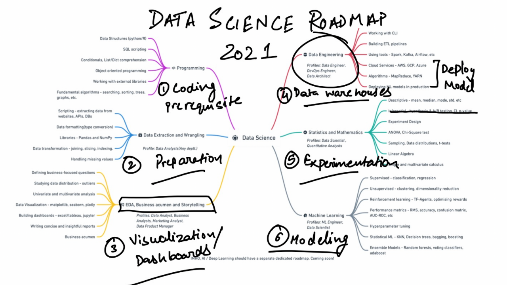

# Data Analysis Roadmap

1. Define the problem and determine the goals of the analysis
2. Acquire and clean the data
3. Explore and visualize the data to gain insights
4. Model the data using appropriate statistical techniques
5. Validate the model and interpret the results
6. Communicate the findings and conclusions

## Getting Started
1. Clone the repository to your local machine

      ``` git clone gh repo clone AdarshTheki/Data-Analytics-Rodemaps. ```

2. Install the necessary packages

      ``` pip install -r requirements.txt ```

3. Run the Jupyter notebook or Python script to reproduce the analysis

      ```jupyter notebook analysis.ipynb```

## Tools and Libraries Used

-  Python
-  Jupyter Notebook
-  Pandas, Numpy, Matplotlib, Seaborn for data manipulation and visualization
-  Scikit-learn for modeling

## Contributions
Feel free to open a pull request or an issue if you find any bug or have any suggestions for improvements.

## Authors
-  **[Adarsh Verma](https://github.com/AdarshTheki/)**

## License
This project is licensed under the **[MIT License](https://opensource.org/licenses/MIT)**

## Conclusion
This is a general roadmap for a data analysis project. The specific steps and tools used may vary depending on the project and the data being analyzed. The goal of this roadmap is to provide a structure for approaching a data analysis project and ensure that all important aspects are considered.


